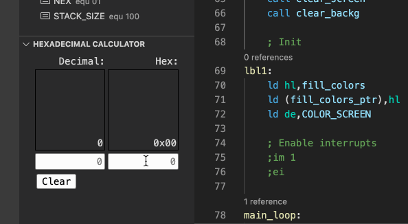
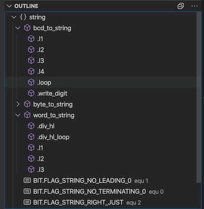
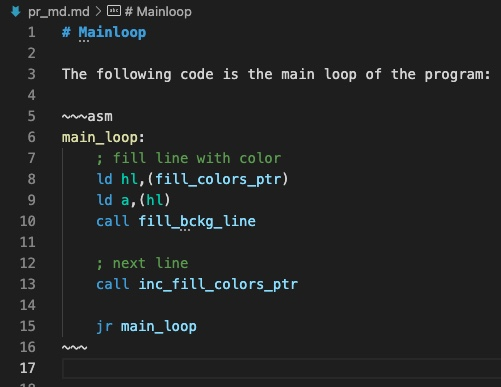

# ASM Code Lens


'ASM Code Lens' is a language server extension for Visual Studio Code for assembler files.
It provides support for:
- Assembler syntax highlighting (Z80 and x86).
- Completions: While you type completions are proposed based on the labels in your asm files.
- "Find all references": through a right mouse click in your assembler source file. It will come up with all found references in the other files.
- Hovering: When hovering over a symbol it shows the comments for the symbol.
- Folding.
- Outline view: View your labels (code, data, constants) in the outline view.
- [Open symbol by name](https://code.visualstudio.com/docs/editor/editingevolved#_open-symbol-by-name)
- [Go to Definition](https://code.visualstudio.com/docs/editor/editingevolved#_go-to-definition)
- [Rename symbols (labels)](https://code.visualstudio.com/docs/editor/editingevolved#_rename-symbol).
- [Code Lenses](https://code.visualstudio.com/docs/editor/editingevolved#_reference-information): Above symbols the number of references is shown. Clicking it reveals the references.
- Find all labels that are not EQU and are not referenced. Useful to find dead code.

Please refer to the "Feature Contributions" tab to see how to enable/disable certain features


## Incompatibilities

If you are using "ASM Code Lens" with other extensions that define assembler language ids (such as [Z80 Macro-Assembler](https://github.com/mborik/z80-macroasm-vscode) or other syntax highlighting extensions for assembly code) you might experience problems. E.g. code lenses do not work.

The underlying problem is that vscode can associate a file only to one language id. I.e. the language id of your assembler files is associated to something else than "Assembler file" ASM Code Lens will not find the file anymore.

When selecting an assembly file the file association is shown in the right side of the status bar, it should show something like:

Otherwise click on it and select the right association.


## Installation

Install through Visual Studio Code Marketplace.
The extension is called "ASM Code Lens".

It supports assembler source files and list files by defining the language identifiers "Assembler file" ('asm-collection') and "Assembler list file" ('asm-list-file').
Your file has to be associated to one of those languages.
By default "Assembler file" contains the following suffixes:
- .asm
- .inc
- .s
- .a80
- .z80

The "Assembler list file" defaults to:
- .list
- .lis

But you can manually add any file or file suffixes to the language ids via vscode (language mode).


## Hexadecimal Calculator

A view in the sidebar of the explorer and the sidebar in debug mode.
It adds a decimal and hexadecimal calculator to vscode.
It always shows 2 columns: decimal and hexadecimal.
If you enter a number in one column it is automatically converted to the other type.

This way it is easily possible to mix calculations between decimal and hexadecimal.

The calculator allows the basic integer calculations:
- addition
- subtraction
- multiplication
- division




## Outline View

An outline view of the assembly can be shown like this:



"ASM Code Lens" uses some heuristics to tell what labels are data, const or code.
So be aware that it's decision might be wrong sometimes.

Note: The outline view also supports sjasmplus MODULE information.


## Find Dead Code

With a right click on a text editor (an asm file) and by selecting 'Find Labels with no Reference'

you get a list of labels (in the OUTPUT pane) that are not referenced anywhere in all files.

This can be useful to find any dead code because code or data that is not referenced is probably not used or the label is superfluous.


## Problem Matcher

For the [sjasmplus](https://github.com/z00m128/sjasmplus) assembler there is a problem matcher included to ease the navigation to compile errors.

You can use it simply by adding the following line to your tasks.json:
~~~
"problemMatcher": "$problem-matcher-sjasmplus",
~~~


## Hovers in Debug Mode

vscode turns the normal hovers off if in debug mode. To make them visible press the "ALT" key while hovering.


## Syntax highlighting in Markdown code blocks

Assembler syntax highlighting can also be used within Markdown documents.
Just add ```asm``` (or ```list```) to your code blocks.

Here is an example:
```
# Mainloop

The following code is the main loop of the program:

~~~asm
main_loop:
    ; fill line with color
    ld hl,(fill_colors_ptr)
    ld a,(hl)
    call fill_bckg_line

    ; next line
    call inc_fill_colors_ptr

    jr main_loop
~~~
```

Which results in the following highlighting:



# Statistics Data

The extension collects anonymous usage data to help improve its features, performance, and stability.
The extension respects VS Code’s global telemetry settings. If you disable telemetry in VS Code, this extension will also stop sending data.


# License and Acknowledgements

This extension uses code from the [vscode-whats-new](https://github.com/alefragnani/vscode-whats-new) project from Alessandro Fragnani aka [alefragni](https://github.com/alefragnani), MIT License.

I also included the grammar for syntax highlighting from Martin Bórik's vscode extension [z80-macroasm-vscode](https://github.com/mborik/z80-macroasm-vscode) because I got problems when running both extensions at the same time and I could not turn off features selectively.
I.e. I copied the files language.configuration.json and z80-macroasm.tmLanguage.json. The z80-macroasm-vscode extension itself was forked from Imanol Barriuso's vscode extension [z80asm-vscode](https://github.com/Imanolea/z80asm-vscode). MIT license, copyright (c) 2016 Imanol Barriuso (Imanolea).

Many thanks to the authors.

I also would like to thank these contributors:
- [kborowinski](https://github.com/kborowinski) for PRs regarding sjasmplus ([#20](https://github.com/maziac/asm-code-lens/pull/20), [#21](https://github.com/maziac/asm-code-lens/pull/21), [#22](https://github.com/maziac/asm-code-lens/pull/22), [#44](https://github.com/maziac/asm-code-lens/pull/44), [#47](https://github.com/maziac/asm-code-lens/pull/47), [#50](https://github.com/maziac/asm-code-lens/pull/50)).
- [chrijbel](https://github.com/chribjel) for PR #53 [Added support for changing the line comment prefix](https://github.com/maziac/asm-code-lens/pull/53).
- [64kramsystem](https://github.com/64kramsystem) for PR #65 [Add syntax highlight to Markdown code blocks](https://github.com/maziac/asm-code-lens/pull/65).
- [Crystal-RainSlide](https://github.com/Crystal-RainSlide) for PR #90 [Use esbuild](https://github.com/maziac/asm-code-lens/pull/90) which decreased the size of extension a lot.
- [Coolspy3](https://github.com/CoolSpy3) for PR #92/93 (x86 syntax highlighting improvements).
- [mwpenny](https://github.com/mwpenny) for PR #98 (Properly show symbol kinds and structs/modules in document outline #98).
- [rahulsenna](https://github.com/rahulsenna) for PR #100 (Enable vscode's "auto surround" feature)
- And all the others who contributed and entered error reports.
